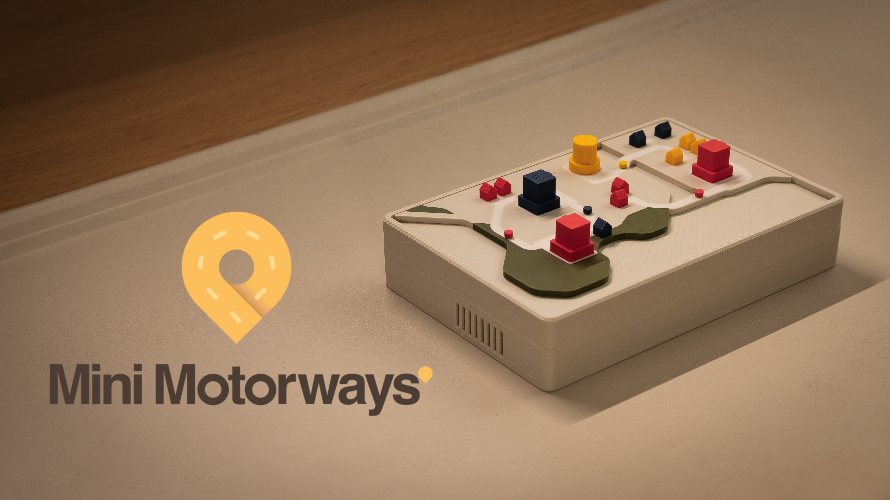

# **MiniMotorways ESP32 Project**

This project is an ESP32-based application for controlling a servo motor and fetching traffic data using the TomTom API. It includes a webserver for configuring Wi-Fi, servo settings, and TomTom API details. It is designed to be used with my MiniMotorways project.



Check out my youtube video for the full project!


## **Features**
- Servo motor control with configurable pin and pulse settings.
- Fetches real-time traffic data using the TomTom API.
- Webserver for configuring Wi-Fi, servo, and API settings.
- Stores configuration in NVS (Non-Volatile Storage) for persistence across reboots.

## **Requirements**
- **Hardware**:

    All hardware BOM and full guide are available on my patreon here!

- **Software**:
  - [PlatformIO](https://platformio.org/) for building and flashing the firmware.
  - [Python](https://www.python.org/) with `esptool` installed for manual flashing.
  - A TomTom API key for fetching traffic data.

## **Installation**

#### Using Precompiled Firmware from GitHub Releases:
1. Download the latest `.bin` file from the [Releases](https://github.com/your-repo/minimotorways/releases) page.
2. Install the latest version of Python from [here](https://www.python.org/downloads/) and ensure you add it to your system PATH.
3. Open a command prompt and install `esptool.py`:
   ```bash
   pip install esptool
4. Connect your ESP32 board to your computer via USB.
5. Identify the COM port (e.g., COM3 on Windows or /dev/ttyUSB0 on Linux/Mac). You can find this in your device manager. In my case my port is COM33

   
7. Navigate to the directory where you downloaded the `.bin` file.
8. Flash the firmware, replace <COM_PORT> with the port where your ESP32 is connected (e.g., COM3 or /dev/ttyUSB0).
    ```bash
    python -m esptool --chip esp32-c3 --port <COM_PORT> --baud 460800 write_flash -z 0x1000 firmware.bin
9. Once the flashing process is complete, the ESP32 will reboot and start running the firmware.

### **Configuration**
1. After flashing the firmware, you should see a Wi-Fi SSID called `MiniMotorways`:

    
2. Connect to it from your computer with the password:
    ```
    minimotorways
    ```
3. Once connected to the ESP32, on a browser navigate to the ip address:
    ```
    192.168.4.1
    ```
    A form should show up like this:

    

4. For each of the config items refer to the table below to figure out the config item:

| Config Item       | Description                     | Info                           |
|-------------------|---------------------------------| ------------------------------ |
| WiFi SSID         | Your Wi-Fi network name         | Make sure to use only a 2.4GHz network as ESP32-C3 does not support 5GHz.|
| WiFi Password     | Your Wi-Fi network password     |                                |
| Servo Pin         | GPIO pin connected to the servo | If following my build use `2`    |
| Servo Min Pulse   | Minimum pulse width (in µs)     | Put default value as `510` however may need to calibrate      |
| Servo Max Pulse   | Maximum pulse width (in µs)     | Put default value as `2490` however may need to calibrate     |
| TomTom API Key    | Your TomTom API key             | Follow the guide [here](https://developer.tomtom.com/knowledgebase/platform/articles/how-to-get-an-tomtom-api-key/), to get your free api key. |
| Latitude          | Latitude of your location       | Use a site like [this](https://www.latlong.net/) to input your address to find your latitude. |
| Longitude         | Longitude of your location      | Use the same site as above to find your longitude. |
| Zoom Level        | Zoom level for traffic data     | Zoom level should be 14. Tracks traffic in a 2-5km radius around your coordinates.|


5. After entering all config items and clicking save, the esp32 should reset, the webserver will shut down and your esp32 should start pulling traffic data from TomTom and the servo should start moving!

6. To check if everything works, disconnect the usb-c cable and reconnect it. On rebooting, the servo should rotate 30 degrees twice before starting the constant rotation of 180 degrees, if it can connect to wifi and access the TomTom traffic data.


## **Troubleshooting**

### **Connection Issues When Flashing**
If you're unable to connect or flash your ESP32-C3, try the following steps:

1. **Install the Required Drivers**:
   - Download and install the USB-to-UART bridge drivers from [here](https://www.silabs.com/developer-tools/usb-to-uart-bridge-vcp-drivers).

2. **Follow Seeed Studio's Recommendations**:
   - Refer to the troubleshooting guide [here](https://wiki.seeedstudio.com/XIAO_ESP32C3_Getting_Started/#q1-my-arduino-ide-is-stuck-when-uploading-code-to-the-board) for additional tips.

---

### **Servo Not Moving Correctly**
If the servo starts moving from 0° to 180° constantly after powering the ESP32, it means the ESP32 either:
- Cannot connect to your Wi-Fi network, or
- Cannot fetch data from the TomTom API.

The expected behavior is:
1. The servo should move 30° twice, pause, and then start moving from 0° to 180° constantly if everything is working correctly.

#### **Steps to Troubleshoot**:
1. **Verify TomTom Configuration**:
   - Ensure your TomTom API key and coordinates are correct.
   - Test the API key and coordinates using `curl` in your command prompt or terminal:
     ```bash
     curl "http://api.tomtom.com/traffic/services/4/flowSegmentData/absolute/14/json?key=<your-key>&point=<latitude>,<longitude>"
     ```
   - You should receive a JSON response starting with `flowSegmentData`. If not:
     - Double-check your API key.
     - Verify the latitude and longitude values.

2. **Erase and Reflash the ESP32**:
   - Erase the flash memory on the ESP32:
     ```bash
     python -m esptool --chip esp32-c3 --port <COM_PORT> erase_flash
     ```
   - Reflash the firmware and follow the configuration steps again.


---

## **Contributing**

If you would like to fix bugs, add new features, or help maintain the project, here’s how you can get started:

### **How to Contribute**
1. **Fork the Repository**:
   - Click the "Fork" button on the top-right corner of the GitHub repository page to create your own copy of the project.

2. **Clone the Repository**:
   - Clone your forked repository to your local machine:
     ```bash
     git clone https://github.com/<your-username>/minimotorways.git
     cd minimotorways
     ```

3. **Create a New Branch**:
   - Create a branch for your feature or bug fix:
     ```bash
     git checkout -b feature-or-bugfix-name
     ```

4. **Make Your Changes**:
   - Modify the code, documentation, or other files as needed.
   - Ensure your changes follow the project's coding style and guidelines.

5. **Test Your Changes**:
   - Test your changes thoroughly to ensure they work as expected and do not introduce new issues.

6. **Submit a Pull Request**:
   - Push your changes to your forked repository:
     ```bash
     git push origin feature-or-bugfix-name
     ```
   - Open a pull request on the original repository and provide a clear description of your changes.

---

### **Contact for Collaboration**
If you'd like to help maintain and improve the project, feel free to reach out!
Email me at **matthewlimdiy@gmail.com** with your GitHub profile.

---
